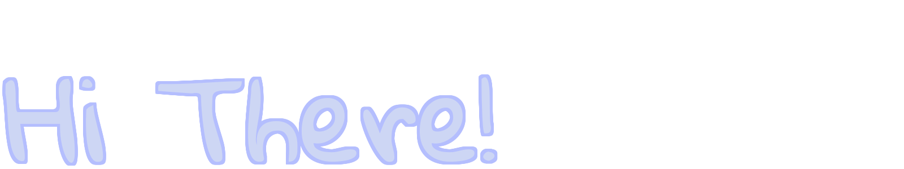
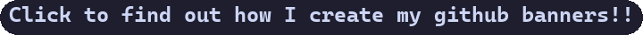

<picture>
  <source media="(prefers-color-scheme: dark)" srcset="./assets/intro-dark.png">
  <source media="(prefers-color-scheme: light)" srcset="./assets/intro-light.png">
  
</picture>
 
 

  <a href="https://github.com/vanillaPenguin/Catppuccin-Banner", align="center">
    <picture>
      <source media="(prefers-color-scheme: dark)" srcset="./assets/banner-link-dark.png">
      <source media="(prefers-color-scheme: light)" srcset="./assets/banner-link-light.png">
      
    </picture>
  </a>

<!--
❯ python banner.py --path="../vanillaPenguin/assets/banner-link-dark.png" --text="Click to find out how I create my github banners
!!" --flavour=mocha --text-color=text --text-border-color=text --image-size=720x40 --image-border-color=text --font="./fonts/Casca
diaCode/CaskaydiaCoveNerdFontMono-Bold.ttf" --image-border-radius=20 --text-align=left --text-geometry=10,2 --image-border-size=0 
--font-size=24
❯ python banner.py --path="../vanillaPenguin/assets/banner-link-light.png" --text="Click to find out how I create my github banner
s!!" --flavour=latte --text-color=text --text-border-color=text --image-size=720x40 --image-border-color=text --font="./fonts/Casc
adiaCode/CaskaydiaCoveNerdFontMono-Bold.ttf" --image-border-radius=20 --text-align=left --text-geometry=10,2 --image-border-size=0
 --font-size=24
-->

-------
###  Hello guys👋

<!--
**vanillaPenguin/vanillaPenguin** is a ✨ _special_ ✨ repository because its `README.md` (this file) appears on your GitHub profile.

Here are some ideas to get you started:

- 🔭 I’m currently working on ...
- 🌱 I’m currently learning ...
- 👯 I’m looking to collaborate on ...
- 🤔 I’m looking for help with ...
- 💬 Ask me about ...
- 📫 How to reach me: ...
- 😄 Pronouns: ...
- ⚡ Fun fact: ...
-->
